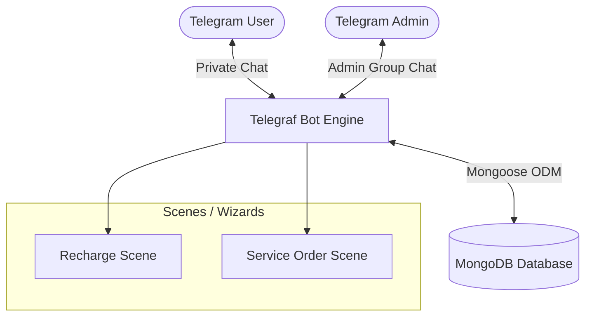

# SaveTimePro_bot - Project Plan & System Architecture

This document outlines the architecture, database design, directory structure, and core workflows for the **SaveTimePro_bot**, a semi-automated Telegram bot functioning as a storefront for freelance, academic, and utility services.

---

## 1. System Architecture

The application is designed around **Clean Architecture** principles in Node.js, decoupling the entry points, bot handlers, business models, and external configuration.



### Components:
1. **Telegram Client (User):** Initiates commands (`/start`, `/recharge`), navigates inline menus, checks balance, and submits service requests with files.
2. **Telegram Client (Admin Group):** Receives automated notifications from the bot for pending wallet deposits and service orders. Admins approve/reject deposits via inline buttons, and fulfill orders by replying to the bot's forwarded order messages.
3. **Telegraf Bot Engine (Node.js):** Orchestrates message routing, scene states, keyboard menus, and admin interactions.
4. **Database (MongoDB & Mongoose):** Persists user profiles, transaction logs, and order histories.

---

## 2. Directory Structure

To keep the codebase modular, clean, and scalable, we use the following directory layout:

```text
/SaveTimePro_bot
├── /config             # Configuration files
│   └── db.js           # Database connection configuration
├── /models             # Mongoose database models
│   ├── User.js         # User profiles & balance tracking
│   ├── Order.js        # Service order logs
│   └── Deposit.js      # Deposit history & approval status
├── /bot                # Telegram bot modules
│   ├── /scenes         # Telegraf Wizard/Base Scenes
│   │   ├── recharge.js # Wallet recharge wizard
│   │   └── service.js  # Service submission wizard
│   ├── /handlers       # Command, action, and message handlers
│   │   ├── admin.js    # Logic for handling admin responses/approvals
│   │   └── menu.js     # Bot keyboards and navigation menus
│   └── bot.js          # Bot initialization & middleware setup
├── /utils              # Helper functions & middleware
│   └── helpers.js      # Formatters, order ID generators, etc.
├── .env.example        # Environment variables template
├── index.js            # Main entry point
├── package.json        # Node.js dependencies and scripts
└── project_plan.md     # Project documentation
```

---

## 3. Database Schemas

We define three core Mongoose models to handle states and transactions.

### User Schema (`models/User.js`)
Tracks user identity, telegram metadata, current points/balance, and joining dates.
```javascript
{
  telegramId: { type: String, required: true, unique: true, index: true },
  username: { type: String },
  firstName: { type: String },
  lastName: { type: String },
  balance: { type: Number, default: 0, min: 0 },
  joinedAt: { type: Date, default: Date.now }
}
```

### Deposit Schema (`models/Deposit.js`)
Tracks the history of deposits, the uploaded screenshot receipt, and administrative approval state.
```javascript
{
  depositId: { type: String, required: true, unique: true, index: true },
  telegramId: { type: String, required: true, index: true },
  amount: { type: Number, required: true },
  receiptFileId: { type: String }, // File ID of the payment receipt image
  status: { type: String, enum: ['pending', 'approved', 'rejected'], default: 'pending' },
  createdAt: { type: Date, default: Date.now }
}
```

### Order Schema (`models/Order.js`)
Tracks service purchases, user uploaded files/parameters, price in points, and fulfilment delivery.
```javascript
{
  orderId: { type: String, required: true, unique: true, index: true },
  telegramId: { type: String, required: true, index: true },
  serviceType: { 
    type: String, 
    required: true,
    enum: [
      'similarity_report', 'ai_writing_report', // Arbitrage Services
      'cv_design', 'portfolio_design',         // Design Services
      'pdf_to_word', 'translation'             // Utilities
    ] 
  },
  status: { 
    type: String, 
    enum: ['pending_payment', 'paid', 'in_progress', 'completed', 'cancelled'], 
    default: 'paid' 
  },
  price: { type: Number, required: true }, // Deducted points
  fileId: { type: String },                // User's original file (if any)
  textInput: { type: String },             // Text/details provided by user
  adminMessageId: { type: Number },        // Bot's message ID forwarded to Admin Group
  deliveredFileId: { type: String },       // Processed result file from admin
  createdAt: { type: Date, default: Date.now }
}
```

---

## 4. Core Workflows

### 4.1 Wallet Recharge (Deposit -> Admin Approval -> Balance Update)
This process allows users to request point additions by paying via an external method and uploading proof.

```mermaid
sequenceDiagram
    autonumber
    actor User
    participant Bot as Telegram Bot
    actor Admin
    database DB as MongoDB
    
    User->>Bot: /recharge (Enters Recharge Scene)
    Bot->>User: Ask for deposit amount & receipt screenshot
    User->>Bot: Uploads receipt photo & inputs amount
    Bot->>DB: Save Deposit (status: pending)
    Bot->>Admin: Forward Receipt to Admin Group with [Approve] / [Reject]
    Admin->>Bot: Clicks [Approve] button
    Bot->>DB: Update Deposit status to 'approved'
    Bot->>DB: Update User balance += amount
    Bot->>User: Notify "Deposit Approved! X points added."
```

### 4.2 Arbitrage Services (Similarity Report, AI Writing Report)
High-academic integrity checks. These services analyze documents.
1. **User Request:** User selects "Similarity Report" or "AI Writing Report".
2. **Balance Check:** Bot checks if `User.balance >= Service.price`.
3. **Execution:**
   - Bot prompts user for the document (PDF/Docx).
   - Once uploaded, Bot deducts points from the user's balance and creates an `Order` (`status: paid`).
   - Bot forwards the document file to the Admin Group with order info and inline details.
   - Admin runs the report manually (Turnitin, GPT-zero, etc.).
   - Admin replies directly to the forwarded message in the Admin Group with the resulting file.
   - Bot receives the reply, extracts the file ID, sends the file back to the User, and updates `Order` to `completed`.

### 4.3 Design Services (CV, Portfolio)
Visual styling and professional showcase creation.
1. **User Request:** User selects "CV Design" or "Portfolio Design".
2. **Balance Check:** Bot checks if balance is sufficient.
3. **Execution:**
   - Bot enters a Wizard scene asking the user to upload their current resume/text details and select a theme/style preference.
   - Bot creates an `Order` and deducts points.
   - Bot sends a structured briefing message (containing user details and attachments) to the Admin Group.
   - Admin designs the CV or Portfolio.
   - Admin replies to the bot's message in the Admin Group with the final design files (PDF, PNG).
   - Bot delivers the final design to the user, completes the order.

### 4.4 Utilities (PDF to Word, Translation)
Convenience file conversions and language translations.
1. **User Request:** User selects "PDF to Word" or "Translation".
2. **Balance Check:** Bot checks if balance is sufficient (usually lower price than specialized services).
3. **Execution:**
   - For Translation, Bot asks for target language and the file/text. For PDF to Word, Bot asks for the PDF.
   - Points are deducted; `Order` is logged.
   - The task is dispatched to the Admin Group.
   - Admin performs the conversion or translation.
   - Admin replies with the completed document/text.
   - Bot forwards the response file/text to the user and marks the order `completed`.
